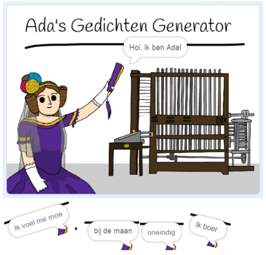

## Wat kun je verder nog doen?

Bekijk het [Ada's Gedichten Generator](https://projects.raspberrypi.org/nl-NL/projects/poetry-generator) Scratch project.

--- no-print ---

  <iframe allowtransparency="true" width="485" height="402" src="https://scratch.mit.edu/projects/embed/381618574/?autostart=false" frameborder="0" scrolling="no"></iframe>
  

--- /no-print ---

--- print-only ---

--- /print-only ---

***

Dit project werd vertaald door vrijwilligers:

Sanneke van der Meer
Robert-Jan Kempenaar
Cor

Dankzij vrijwilligers kunnen we mensen over de hele wereld de kans geven om in hun eigen taal te leren. Jij kunt ons helpen meer mensen te bereiken door vrijwillig te starten met vertalen - meer informatie op [rpf.io/translate](https://rpf.io/translate).