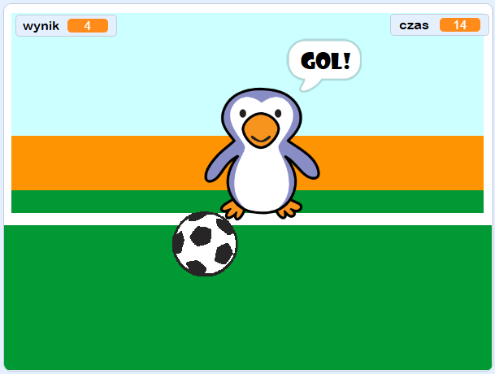

--- no-print ---

To jest wersja projektu korzystająca ze **Scratch 3**. Istnieje również [wersja tego projektu dla Scratch 2](https://projects.raspberrypi.org/en/projects/beat-the-goalie-scratch2).

--- /no-print ---

## Wprowadzenie

W tym projekcie nauczysz się, jak stworzyć dwuosobową grę w piłkę nożną, w której musisz zdobyć jak najwięcej goli w ciągu 30 sekund.

### Co stworzysz

--- no-print ---

Kliknij na zieloną flagę, aby rozpocząć. Użyj strzałek w lewo i w prawo do kontrolowania celu i naciśnij <kbd>spację</kbd> aby kopnąć piłkę.

  <iframe allowtransparency="true" width="485" height="402" src="https://scratch.mit.edu/projects/embed/285942132/?autostart=false" frameborder="0" scrolling="no"></iframe>

--- /no-print ---

--- print-only ---

--- /print-only ---

--- collapse ---
---
title: Czego się nauczysz
---

- Przypomnisz sobie, jak używać kodu do reagowania na naciśnięcie klawiszy
- Używać detekcji kolizji obiektów, aby wykryć, kiedy duszki się dotykają
- Jak sprawić, aby duszki się między sobą komunikowały

--- /collapse ---

--- collapse ---
---
title: Czego będziesz potrzebować
---

#### Sprzęt

+ Komputer, na którym można uruchomić Scratch 3

#### Oprogramowanie

+ Scratch 3 (either [online](https://rpf.io/scratchon){:target="_blank"} or [offline](https://rpf.io/scratchoff){:target="_blank"})

#### Pliki do pobrania

Przykładowy projekt znajdziesz [tutaj](https://rpf.io/p/en/beat-the-goalie-go){:target="_blank"}.

--- /collapse ---

--- collapse ---
---
title: Dodatkowe informacje dla nauczycieli
---

--- no-print ---

Jeśli chcesz wydrukować ten projekt, użyj [wersji do druku](https://projects.raspberrypi.org/en/projects/beat-the-goalie/print){:target="_blank"}.

--- /no-print ---

Tutaj może znaleźć [kompletny projekt](https://rpf.io/p/en/beat-the-goalie-get){:target="_blank"}.

--- /collapse ---
