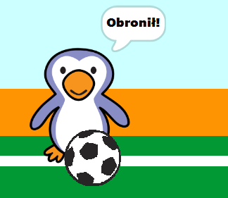

## Czy to był gol?

Gdy piłka osiągnie cel, należy podjąć decyzję. __Jeśli__ piłka dotyka bramkarza, to znaczy że bramka została obroniona, __inaczej__ to jest gol.

--- task ---

Dodaj ten kod na końcu kodu duszka to Twojego bramkarza, abyś mógł sprawdzić, czy piłka go dotyka.


```blocks3
repeat (15)
change y by (10)
end
+if <touching (goalie v)> then
else
end
```

--- /task ---

--- task ---

`Zagraj dźwięk 'grzechotki'`{:class="block3sound"} `jeśli bramkarz obronił strzał`{:class="block3control"}.


```blocks3
if <touching (goalie v)> then
+start sound (rattle v)
else
end
```

--- /task ---

--- task ---

Możesz także nadawać wiadomość do bramkarza, aby mógł powiedzieć ci, że piłka została obroniona.

Nadaj komunikat 'obronił', gdy piłka zostanie obroniona.


```blocks3
if <touching (goalie v)> then
start sound (rattle v)
+broadcast (save v)
else
end
```

--- /task ---

--- task ---

Możesz teraz zakodować swojego bramkarza, aby powiedział 'Obronione!' kiedy otrzyma wiadomość.


```blocks3
when I receive [save v]
say [Save!] for (1) seconds
```

--- /task ---

--- task ---

Przetestuj swój kod, próbując strzelić gola. Jeśli Twój bramkarz obronił strzał, powinien powiedzieć 'Obronione!'.



--- /task ---
