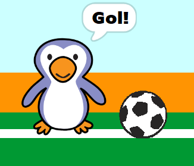

## Gol!

--- task ---

Czy potrafisz odtwarzać dźwięk i zaprogramować bramkarza, aby powiedzieć "Gol!", gdy piłka wpadnie do bramki?

Pamiętaj, że bramka została zdobyta, jeśli piłka nie dotyka bramkarza.



--- hints ---

--- hint ---

`Jeśli piłka nie`{:class="block3control"} `dotykają bramkarza`{:class="block3sensing"} Twój program powinien `zagrać dźwięk radości`{:class="block3sound"} i `nadać komunikat o golu`{:class="block3events"}.

`Kiedy bramkarz otrzyma komunikat o golu`{:class="block3events"} powinien `powiedzieć gol` {:class="block3looks"}.

--- /hint ---

--- hint ---

Będziesz potrzebował tych bloków:

```blocks3
broadcast (goal v)

say [Goal!] for (1) seconds

when I receive [goal v]

start sound (cheer v)
```

--- /hint ---

--- hint ---

Twój kod powinien wyglądać tak:


```blocks3
if <touching (goalie v)> then
start sound (rattle v)
broadcast (save v)
else
+ start sound (cheer v)
+ broadcast (goal v)
end
```


```blocks3
when I receive [goal v]
say [Goal!] for (1) seconds
```

--- /hint ---


--- /hints ---


--- /task ---
