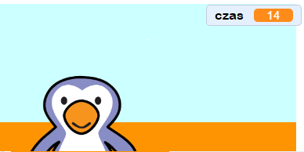

## Dodawanie stopera

Dodajmy licznik czasu, aby gracz musiał zdobyć jak najwięcej goli w ciągu 30 sekund.

--- task ---

`Utwórz nową zmienną`{:class="block3variables"} o nazwie `czas`{:class="block3variables"}.

[[[generic-scratch3-add-variable]]]

--- /task ---

--- task ---

Kliknij swoją __scenę__ i dodaj ten kod, aby ustawić wartość zmiennej `licznik`{:class="block3variables"} na 30 na początku gry.


```blocks3
when green flag clicked
set [czas v] to [30]
```

--- /task ---

--- task ---

Następnie musisz dodać blok `powtarzaj aż`{:class="block3control"}, aby zegar mógł działać, dopóki nie osiągnie wartości 0.


```blocks3
when green flag clicked
set [czas v] to [30]
+repeat until <(czas :: variables) = [0]>
end
```

--- /task ---

--- task ---

Zmniejsz swój licznik czasu o 1 co sekundę, aż osiągnie 0.


```blocks3
when green flag clicked
set [czas v] to [30]
repeat until <(czas :: variables) = [0]>
+wait (1) seconds
+change [czas v] by (-1)
end
```

--- /task ---

--- task ---

Gdy licznik osiągnie 0, powinieneś `grać dźwięk gwizdka`{:class="block3sound"}, a następnie zatrzymać grę.


```blocks3
when green flag clicked
set [czas v] to [30]
repeat until <(czas :: variables) = [0]>
wait (1) seconds
change [czas v] by (-1)
end
+play sound (whistle v) until done
+stop [all v]
```

--- /task ---

--- task ---

Kliknij zieloną flagę, aby przetestować kod. Twój czasomierz powinien zacząć od 30, a kończyć na 0.



Możesz zmienić licznik czasu tak, aby zaczynał od 10, jeśli nie chcesz czekać 30 sekund!

--- /task ---

--- task ---

Masz tylko szansę na zdobycie 1 bramki! Aby mieć więcej niż 1 szansę, dodaj `zawsze`{:class="block3control"} blok wokół kodu Twojej __piłki__. Możesz także dodać blok `czekaj`{:class="block3control"} między próbami.


```blocks3
when green flag clicked
+forever
    go to x:(-200) y:(-140)
    repeat until <key (spacja v) pressed?>
        move (10) steps
        if on edge, bounce
    end
    repeat (15)
        change y by (10)
    end
    if <touching (bramkarz v)> then
        start sound (rattle v)
        broadcast (obronione v)
    else
        start sound (cheer v)
        broadcast (gol v)
    end
end
```

--- /task ---

