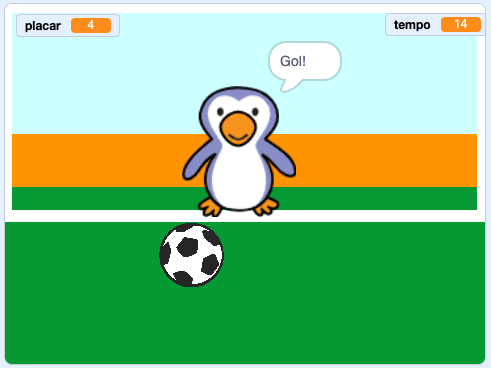

--- no-print ---

Esta é a versão **Scratch 3** do projeto. Há também uma [versão Scratch 2 do projeto](https://projects.raspberrypi.org/en/projects/beat-the-goalie-scratch2).

--- /no-print ---

## Introdução

Neste projeto você aprenderá a criar um jogo de futebol de 2 jogadores no qual você terá que marcar o máximo de gols possível em 30 segundos.

### O que você vai fazer

--- no-print ---

Clique na bandeira verde para começar. Use as setas para a esquerda e para a direita para controlar o goleiro e pressione <kbd>espaço</kbd> para chutar a bola.

  <iframe allowtransparency="true" width="485" height="402" src="https://scratch.mit.edu/projects/embed/285942132/?autostart=false" frameborder="0" scrolling="no"></iframe>

--- /no-print ---

--- print-only ---

--- /print-only ---

--- collapse ---
---
title: O que você vai aprender
---

- Lembre-se de como usar o código para responder às teclas pressionadas
- Use blocos Sensores para detectar quando os atores se tocam
- Use blocos de transmissão de mensagens para comunicação entre atores

--- /collapse ---

--- collapse ---
---
title: O que você vai precisar
---

#### Hardware

+ Um computador capaz de executar o Scratch 3

#### Software

+ Scratch 3 (either [online](https://rpf.io/scratchon){:target="_blank"} or [offline](https://rpf.io/scratchoff){:target="_blank"})

#### Downloads

The starter project can be found [here](https://rpf.io/p/en/beat-the-goalie-go){:target="_blank"}.

--- /collapse ---

--- collapse ---
---
title: Informações adicionais para educadores
---

--- no-print ---

Se você precisar imprimir este projeto, por favor, use a [versão para impressão](https://projects.raspberrypi.org/en/projects/beat-the-goalie/print){:target="_ blank"}.

--- /no-print ---

You can find the [completed project here](https://rpf.io/p/en/beat-the-goalie-get){:target="_blank"}.

--- /collapse ---
