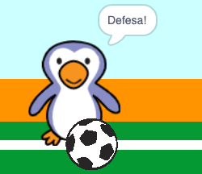

## Foi gol?

Quando a bola atinge o gol, há uma decisão a tomar. __Se__ a bola está tocando o goleiro então foi uma defesa, __senão__ é gol.

--- task ---

Adicione este código ao final do seu código ator bola, para que você possa verificar se a bola está tocando o goleiro.


```blocks3
repeat (15)
change y by (10)
end
+if <touching (goalie v)> then
else
end
```

--- /task ---

--- task ---

` Iniciar o som de 'rattle' (chocalho) `{:class="block3sound"} `se o goleiro defendeu a bola `{:class="block3control"}.


```blocks3
if <touching (goalie v)> then
+start sound (rattle v)
else
end
```

--- /task ---

--- task ---

Você também pode transmitir uma mensagem para o goleiro, para que ele possa dizer que a bola foi defendida.

Transmita uma mensagem 'defesa' quando a bola for defendida.


```blocks3
if <touching (goalie v)> then
start sound (rattle v)
+broadcast (save v)
else
end
```

--- /task ---

--- task ---

Agora você pode programar o seu goleiro para dizer 'Defesa!' quando ele receber a mensagem.


```blocks3
when I receive [save v]
say [Save!] for (1) seconds
```

--- /task ---

--- task ---

Teste seu código tentando marcar um gol. Se o seu goleiro defender a bola, ele deve dizer 'Defesa!'.



--- /task ---
