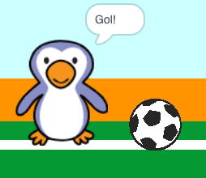

## Gol!

--- task ---

Você consegue tocar um som e programar o seu goleiro para dizer 'Gol!' quando um gol for marcado?

Lembre-se de que um gol foi marcado se a bola não estiver tocando o goleiro.



--- hints ---

--- hint ---

`Se a bola não estiver` {: class = "block3control"} `tocando no goleiro`{:class="block3sensing"} seu programa deve `iniciar o som da torcida`{:class="block3sound"} e `transmita uma mensagem de gol`{:class="block3events"}.

`Quando o goleiro recebe a mensagem de gol`{:class="block3events"} deve `dizer Gol!`{:class="block3looks"}.

--- /hint ---

--- hint ---

Você vai precisar desses blocos:

```blocks3
broadcast (goal v)

say [Goal!] for (1) seconds

when I receive [goal v]

start sound (cheer v)
```

--- /hint ---

--- hint ---

Seu código deve ficar assim:


```blocks3
if <touching (goalie v)> then
start sound (rattle v)
broadcast (save v)
else
+ start sound (cheer v)
+ broadcast (goal v)
end
```


```blocks3
when I receive [goal v]
say [Goal!] for (1) seconds
```

--- /hint ---


--- /hints ---


--- /task ---
