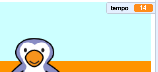

## Adicionando um temporizador

Vamos adicionar um temporizador, para que o jogador tenha que marcar o máximo de gols que puder em 30 segundos.

--- task ---

`Crie uma nova variável`{:class="block3variables"} chamada `tempo`{:class="block3variables"}.

[[[generic-scratch3-add-variable]]]

--- /task ---

--- task ---

Clique no seu __palco__ e adicione este código para definir o `tempo`{:class="block3variables"} a 30 no início do jogo.


```blocks3
when green flag clicked
set [timer v] to [30]
```

--- /task ---

--- task ---

Em seguida, você precisará adicionar um bloco `repita até que`{:class="block3control"}, para que o temporizador possa ser executado até chegar a 0.


```blocks3
when green flag clicked
set [timer v] to [30]
+repeat until <(timer :: variables) = [0]>
end
```

--- /task ---

--- task ---

Reduza seu tempo em 1 a cada segundo até que atinja 0.


```blocks3
when green flag clicked
set [timer v] to [30]
repeat until <(timer :: variables) = [0]>
+wait (1) seconds
+change [timer v] by (-1)
end
```

--- /task ---

--- task ---

Uma vez que o tempo atinja o 0, você deve `tocar o som 'whistle' (apito)`{:class="block3sound"} e então parar o jogo.


```blocks3
when green flag clicked
set [timer v] to [30]
repeat until <(timer :: variables) = [0]>
wait (1) seconds
change [timer v] by (-1)
end
+play sound (whistle v) until done
+stop [all v]
```

--- /task ---

--- task ---

Clique na bandeira verde para testar seu código. Seu tempo deve começar em 30 e terminar em 0.



Você pode alterar seu tempo para começar com 10 se não quiser esperar 30 segundos!

--- /task ---

--- task ---

Você só tem a chance de marcar 1 gol! Para ter mais de 1 chance, adicione um bloco `sempre`{:class="block3control"} ao redor do seu código da __bola__. Você também pode adicionar um bloco `espere`{:class="block3control"} entre as tentativas.


```blocks3
when green flag clicked
+forever
    go to x:(-200) y:(-140)
    repeat until <key (space v) pressed?>
        move (10) steps
        if on edge, bounce
    end
    repeat (15)
        change y by (10)
    end
    if <touching (goalie v)> then
        start sound (rattle v)
        broadcast (save v)
    else
        start sound (cheer v)
        broadcast (goal v)
    end
end
```

--- /task ---

