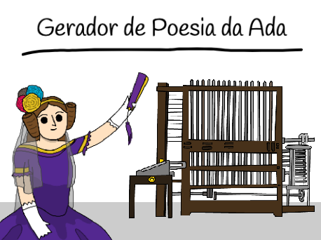

## E agora?

Dê uma olhada no projeto Scratch [Gerador de Poesia de Ada](https://projects.raspberrypi.org/en/projects/poetry-generator).

--- no-print ---

  <iframe allowtransparency="true" width="485" height="402" src="https://scratch.mit.edu/projects/embed/77844926/?autostart=false" frameborder="0" scrolling="no"></iframe>
  

--- /no-print ---

--- print-only ---

--- /print-only ---