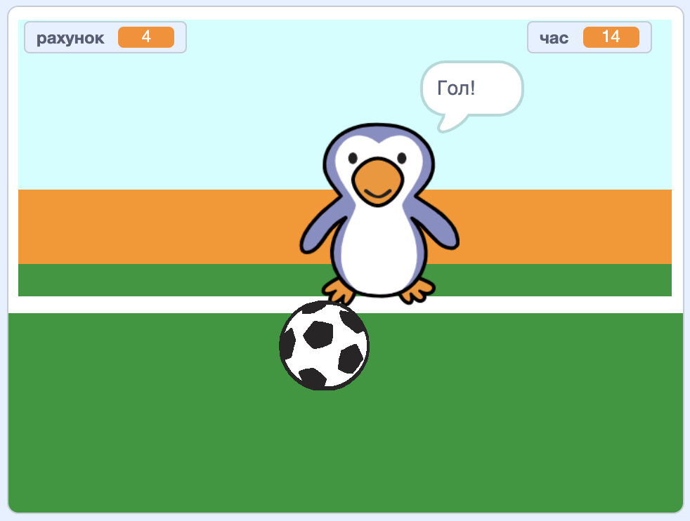

--- no-print ---

Це — версія проєкту для **Скретч 3**. Також існує [версія проєкту для Скретч 2](https://projects.raspberrypi.org/uk-UA/projects/beat-the-goalie-scratch2).

--- /no-print ---

## Вступ

У цьому проєкті ти дізнаєшся як створити футбольну гру з 2 гравцями, в якій треба забити якомога більше голів за 30 секунд.

### Що ти зробиш

--- no-print ---

Натисни на зелений прапор для запуску. Використовуй клавіші зі стрілками вліво та вправо, щоб керувати воротарем, натисни <kbd>пропуск</kbd>, щоб вдарити м’яч.

  <iframe allowtransparency="true" width="485" height="402" src="https://scratch.mit.edu/projects/embed/406772266/?autostart=false" frameborder="0" scrolling="no"></iframe>

--- /no-print ---

--- print-only ---

--- /print-only ---

--- collapse ---
---
title: Чого ти навчишся
---

- Згадаєш, як обробляти натискання клавіш в програмах
- Використовувати блоки датчиків, щоб виявляти коли спрайти дотикаються один до одного
- Використовувати блоки оповіщень для зв’язку між спрайтами

--- /collapse ---

--- collapse ---
---
title: Що тобі знадобиться
---

#### Обладнання

+ Комп'ютер, що підтримує Скретч 3

#### Програмне забезпечення

+ Скретч 3 (або [онлайн](http://rpf.io/scratchon){:target="_blank"}, або [офлайн](http://rpf.io/scratchoff){:target="_blank"})

#### Завантаження

Початковий проєкт можна знайти [тут](http://rpf.io/p/uk-UA/beat-the-goalie-go){:target="_blank"}.

--- /collapse ---

--- collapse ---
---
title: Додаткова інформація для викладачів
---

--- no-print ---

Якщо вам потрібно роздрукувати цей проєкт, будь ласка, скористайтеся [версією для друку](https://projects.raspberrypi.org/uk-UA/projects/beat-the-goalie/print){:target="_blank"}.

--- /no-print ---

Ви можете знайти [завершений проєкт тут](http://rpf.io/p/uk-UA/beat-the-goalie-get){:target="_blank"}.

--- /collapse ---
