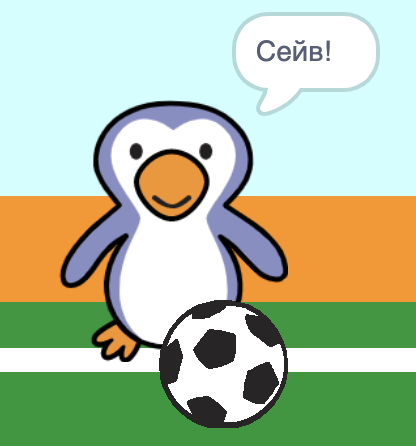

## Що таке гол?

Як тільки м’яч досягне воріт, треба прийняти рішення. __Якщо__ м’яч торкається воротаря, тоді він його ловить (робить сейв), __інакше__ — це гол.

--- task ---

Додай такий код в кінець свого спрайта м’яча, щоб ти міг (могла) перевіряти чи він торкається воротаря.


```blocks3
repeat (15)
change y by (10)
end
+if <touching (Воротар v)> then
else
end
```

--- /task ---

--- task ---

`Відтвори звук "брязкальце"`{:class="block3sound"} `якщо воротар впіймав м’яч`{:class="block3control"}.


```blocks3
if <touching (Воротар v)> then
+start sound (rattle v)
else
end
```

--- /task ---

--- task ---

Також ти можеш оповістити воротаря, щоб він сказав, що здійснив сейв.

Надішли повідомлення "сейв", коли м’яч упіймано.


```blocks3
if <touching (Воротар v)> then
start sound (rattle v)
+broadcast (сейв v)
else
end
```

--- /task ---

--- task ---

Тепер ти можеш запрограмувати воротаря, щоб той казав "Сейв!", коли отримує це повідомлення.


```blocks3
when I receive [сейв v]
say [Сейв!] for (1) seconds
```

--- /task ---

--- task ---

Протестуй свій код, спробувавши забити гол. Якщо твій воротар ловить м’яч, то він має сказати "Сейв!".



--- /task ---
