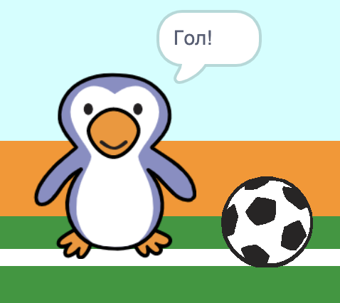

## Гол!

--- task ---

Чи можеш ти відтворити якийсь звук і запрограмувати свого воротаря, щоб той казав "Гол!", коли гол забивають?

Пам’ятай, що гол зараховується, якщо м’яч не торкається воротаря.



--- hints ---


--- hint ---

`Якщо м’яч не`{:class="block3control"} `торкається воротаря`{:class="block3sensing"} твоя програма має `відтворити звук "ура"`{:class="block3sound"} і `оповістити повідомленням "гол"`{:class="block3events"}.

`Коли воротар отримує повідомлення "гол"`{:class="block3events"} він має `говорити "Гол!"`{:class="block3looks"}.

--- /hint ---

--- hint ---

Тобі знадобляться такі блоки:

```blocks3
broadcast (гол v)

say [Гол!] for (1) seconds

when I receive [гол v]

start sound (cheer v)
```

--- /hint ---

--- hint ---

Твій код повинен виглядати так:


```blocks3
if <touching (Воротар v)> then
start sound (rattle v)
broadcast (сейв v)
else
+ start sound (cheer v)
+ broadcast (гол v)
end
```


```blocks3
when I receive [гол v]
say [Гол!] for (1) seconds
```

--- /hint ---


--- /hints ---


--- /task ---
