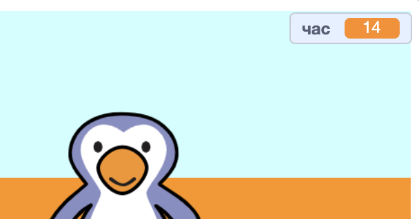

## Додавання таймера

Давай додамо відлік часу, щоб гравець мав забити якомога більше голів за 30 секунд.

--- task ---

`Створи нову змінну`{:class="block3variables"} з назвою `час`{:class="block3variables"}.

[[[generic-scratch3-add-variable]]]

--- /task ---

--- task ---

Клацни на __сцену__ і додай наступний код, щоб встановити `час`{:class="block3variables"} на 30 перед початком гри.


```blocks3
when green flag clicked
set [час v] to [30]
```

--- /task ---

--- task ---

Далі тобі треба додати блок `повторити до`{:class="block3control"}, щоб час ішов, поки не досягне 0.


```blocks3
when green flag clicked
set [час v] to [30]
+repeat until <(час :: variables) = [0]>
end
```

--- /task ---

--- task ---

Зменшуй час на 1 кожну секунду, поки не дійдеш до 0.


```blocks3
when green flag clicked
set [час v] to [30]
repeat until <(час :: variables) = [0]>
+wait (1) seconds
+change [час v] by (-1)
end
```

--- /task ---

--- task ---

Як тільки таймер доходить до 0, тобі треба `відтворити звук "свисток"`{:class="block3sound"}, а далі — зупинити гру.


```blocks3
when green flag clicked
set [час v] to [30]
repeat until <(час :: variables) = [0]>
wait (1) seconds
change [час v] by (-1)
end
+play sound (whistle v) until done
+stop [all v]
```

--- /task ---

--- task ---

Клацни на зелений прапор, щоб перевірити свій код. Твій таймер повинен починатись із 30 і закінчуватись, коли досягне 0.



Ти можеш виставити свій таймер на 10 секунд, якщо не хочеш чекати 30!

--- /task ---

--- task ---

Зараз в тебе є шанс забити лише 1 гол! Щоб мати більше шансів, додай блок `завжди`{:class="block3control"} навколо свого коду для __м’яча__. Ти також можеш додати блок `чекати`{:class="block3control"} між спробами.


```blocks3
when green flag clicked
+forever
    go to x:(-200) y:(-140)
    repeat until <key (space v) pressed?>
        move (10) steps
        if on edge, bounce
    end
    repeat (15)
        change y by (10)
    end
    if <touching (Воротар v)> then
        start sound (rattle v)
        broadcast (сейв v)
    else
        start sound (cheer v)
        broadcast (гол v)
    end
end
```

--- /task ---

