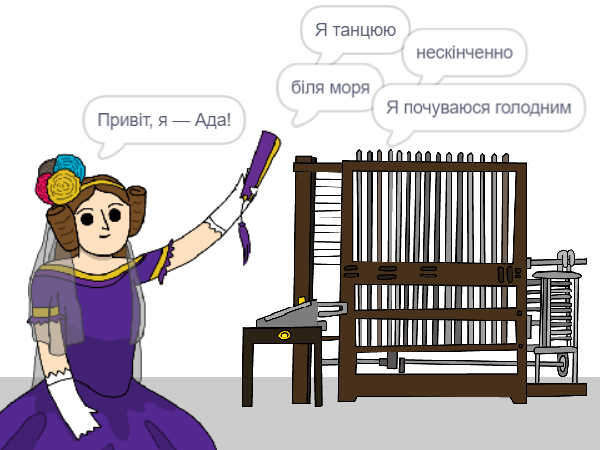

## Що далі?

Поглянь на проєкт Скретч [Генератор віршів Ади](https://projects.raspberrypi.org/uk-UA/projects/poetry-generator).

--- no-print ---

  <iframe allowtransparency="true" width="485" height="402" src="https://scratch.mit.edu/projects/embed/382941134/?autostart=false" frameborder="0" scrolling="no"></iframe>
  

--- /no-print ---

--- print-only ---

--- /print-only ---

***
Цей проєкт переклали волонтери:

Володимир Соботович

Іванна Вереш Кіллін

Завдяки волонтерам, ми надаємо можливість людям у всьому світі навчатися рідною мовою. Ви також можете допомогти нам у цьому — більше інформації про волонтерську програму на [rpf.io/translate](https://rpf.io/translate).