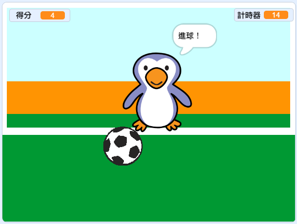

--- no-print ---

這個專案是 **Scratch 3** 版本。 另外還有 [Scratch 2](https://projects.raspberrypi.org/en/projects/beat-the-goalie-scratch2) 版本。

--- /no-print ---

## 介紹

在這個項目中，您將學習如何建立一個2人制足球比賽，其中您必須盡可能的在30秒內進越多球越好。

### 你將會做出

--- no-print ---

點擊綠旗開始。 使用左右方向鍵控制守門員。按<kbd>空白鍵</kbd> 來射門。

  <iframe allowtransparency="true" width="485" height="402" src="https://scratch.mit.edu/projects/embed/285942132/?autostart=false" frameborder="0" scrolling="no"></iframe>

--- /no-print ---

--- print-only ---

--- /print-only ---

--- collapse ---
---
title: 你會學到
---

- 回顧如何使用程式來回應按鍵
- 使用感應積木檢測角色何時相互接觸
- 使用廣播積木在角色之間進行溝通

--- /collapse ---

--- collapse ---
---
title: 你會用到
---

#### 硬體

+ 可運行 Scratch 3 的電腦

#### 軟體

+ Scratch 3 (either [online](https://rpf.io/scratchon){:target="_blank"} or [offline](https://rpf.io/scratchoff){:target="_blank"})

#### 下載

The starter project can be found [here](https://rpf.io/p/en/beat-the-goalie-go){:target="_blank"}.

--- /collapse ---

--- collapse ---
---
title: 給教師的其它資訊
---

--- no-print ---

如果您需要列印此專案內容，請下載 [列印版本](https://projects.raspberrypi.org/en/projects/beat-the-goalie/print){:target =“_ blank”}。

--- /no-print ---

You can find the [completed project here](https://rpf.io/p/en/beat-the-goalie-get){:target="_blank"}.

--- /collapse ---
