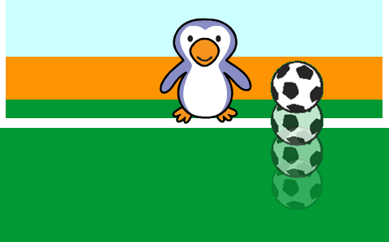

## 讓足球動起來

讓我們來編寫程式讓球在舞台底部移動。

--- task ---

打開“打敗守門員” Scratch入門專案。

**Online**: open the starter project at [rpf.io/beat-the-goalie-on](https://rpf.io/beat-the-goalie-on){:target="_blank"}.

如果你有 Scratch 帳戶，你就可以直接**改編**專案。

**Offline**: open the [starter project](https://rpf.io/p/en/beat-the-goalie-go){:target="_blank"} in the offline editor.

If you need to download and install the Scratch offline editor, you can find it at [rpf.io/scratchoff](https://rpf.io/scratchoff){:target="_blank"}.

在入門專案中，你應該可以看到球門背景, 一顆足球以及守門員角色。


--- /task ---

--- task ---

點擊您的足球角色， 添加此程式，讓足球沿著屏幕底部移動，直到按下空格鍵為止。


```blocks3
when green flag clicked
repeat until <key (space v) pressed?>
move (10) steps
if on edge, bounce
end
```

--- /task ---

--- task ---

現在，點擊綠色旗標來測試您的專案。 您的足球應該沿著屏幕底部反彈，直到按下空格鍵為止。


--- /task ---

--- task ---

將此程式添加到您的足球角色中，讓您在在按下空格鍵後，足球向目標移動。


```blocks3
when green flag clicked
repeat until <key (space v) pressed?>
move (10) steps
if on edge, bounce
end
+ repeat (15)
change y by (10)
end
```

--- /task ---

--- task ---

現在，點擊綠色旗標來測試您的程式。 這次，按下空格鍵，您的足球應該要朝著目標前進。



--- /task ---

--- task ---

現在，點擊綠色旗標來測試您的程式。 如果你再按了綠旗，會發生什麼呢？ 你能解決這個問題嗎？

--- hints ---

--- hint ---

當`綠旗` {：class =“ block3events”}被點擊之後，角色會`回到` {：class =“ block3motion”}起始點。

--- /hint ---

--- hint ---

你會需要這個積木：

```blocks3
go to x:(-200) y:(-140)
```

--- /hint ---

--- hint ---

你的程式應該會像這樣：


```blocks3
when green flag clicked
+ go to x:(-200) y:(-140)
repeat until <key (space v) pressed?>
move (10) steps
if on edge, bounce
end
repeat (15)
change y by (10)
end
```

--- /hint ---

--- /hints ---

--- /task ---

