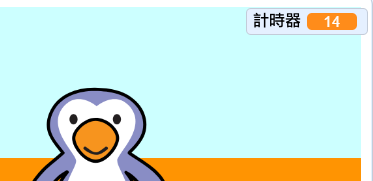

## 添加計時器

讓我們添加一個計時器，讓玩家盡可能在30秒內進越多球越好。

--- task ---

`建立一個新變量`{:class="block3variables"} 稱為 `計時器`{:class="block3variables"}。

[[[generic-scratch3-add-variable]]]

--- /task ---

--- task ---

點擊您的__階段__ ，並加入此程式以設置在遊戲開始時，` 計時器 ` {：class =“ block3variables”}為30。


```blocks3
when green flag clicked
set [timer v] to [30]
```

--- /task ---

--- task ---

接下來，您需要添加`重複直到` {：class =“ block3control”}的積木，讓計時器可以倒數直到變為0。


```blocks3
when green flag clicked
set [timer v] to [30]
+repeat until <(timer :: variables) = [0]>
end
```

--- /task ---

--- task ---

將您的計時器以每秒減少1，直到它到達0。


```blocks3
when green flag clicked
set [timer v] to [30]
repeat until <(timer :: variables) = [0]>
+wait (1) seconds
+change [timer v] by (-1)
end
```

--- /task ---

--- task ---

一旦計時器達到0，您應該`播放“嘯叫”聲` {：class =“ block3sound”}，然後停止遊戲。


```blocks3
when green flag clicked
set [timer v] to [30]
repeat until <(timer :: variables) = [0]>
wait (1) seconds
change [timer v] by (-1)
end
+play sound (whistle v) until done
+stop [all v]
```

--- /task ---

--- task ---

現在，點擊綠色旗標來測試您的程式。 您的計時器應從30開始，0結束。



如果不想等待30秒，你可以將計時器更改為從10秒開始倒數！

--- /task ---

--- task ---

你只有可能進1顆球！ 要獲得1次以上的機會，請添加`永久 ` {：class =“ block3control”}積木在您的__足球__程式周圍。 您還可以在兩次的嘗試中添加`等待` {：class =“ block3control”}積木。


```blocks3
when green flag clicked
+forever
    go to x:(-200) y:(-140)
    repeat until <key (space v) pressed?>
        move (10) steps
        if on edge, bounce
    end
    repeat (15)
        change y by (10)
    end
    if <touching (goalie v)> then
        start sound (rattle v)
        broadcast (save v)
    else
        start sound (cheer v)
        broadcast (goal v)
    end
end
```

--- /task ---

